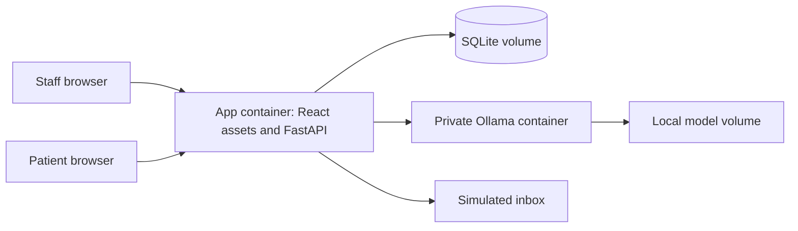
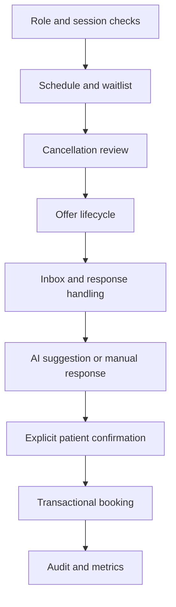
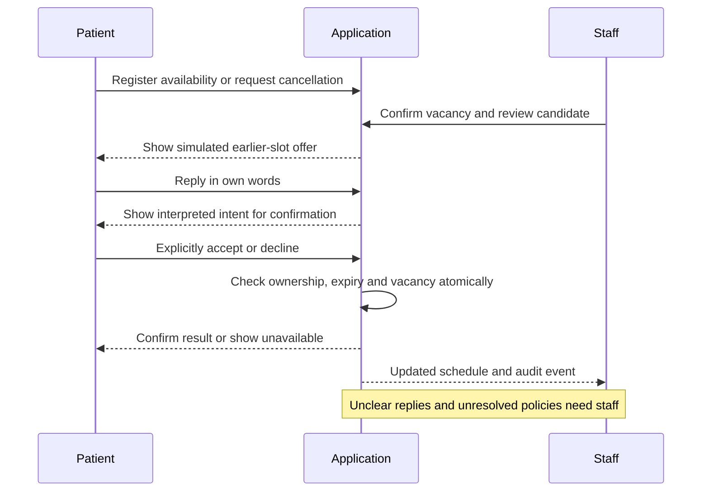

# Smart Appointment Queue — Technical Proposal

**Summary:** Proposed 48-hour build of a single-office scheduling and waitlist demo, with patient confirmation and optional AI reply assistance. Nothing in this proposal is implemented or benchmarked.
**Sources:** [README](README.md), [BOOTSTRAP](BOOTSTRAP.md), [design guideline](ProposedDesign.md), [original Idea 3](caribbean-ai-summit-hackathon-health-ideas.md#idea-3-smart-appointment-queue-for-medical-offices). Official technology references are linked below and were checked October 7, 2026.
**Last updated:** 2026-10-07

## 1. Objective and scope

Demonstrate a confirmed cancellation becoming one accepted replacement, while staff can explain every change. The guideline includes patient registration, office/insurance grouping, schedule, waitlist, cancellations, notifications and statistics; it explicitly remains an unapproved whiteboard transcription. (source: ProposedDesign.md, §§1–9)

**Recommendation:** one fictional office, 20–30 synthetic appointments, a small waitlist, two role-based web views and simulated notifications. Include patient and staff-assisted registration, staff-managed priorities, cancellation review, one-at-a-time offers, explicit acceptance, statistics and an activity log. AI only interprets brief EN/ES replies; patient confirmation controls booking. This narrows the guideline using the README’s proposed scope, not a new source requirement.

**Defer:** cross-office reassignment, insurance verification, EHR connections, real email/SMS/voice delivery, predictive no-show scoring, clinical triage, payments, automatic daily rescheduling and production deployment. Physician cancellation remains supported as staff-reviewed disruption handling; a cancelled provider session must not become available capacity.

## 2. Conflicts and provisional decisions

| Source difference / uncertainty | Recommendation requiring agreement |
|---|---|
| Guideline permits cross-office moves for short-notice physician cancellation; bootstrap defers other offices | Show “manual relocation required”; no simulated success or automatic transfer |
| Patient rules cover ≥24h; physician rules cover >24h and <24h, omitting exactly 24h | Display lead time; unresolved boundary goes to staff. Do not invent a branch |
| Priorities 1–3 exist, but ordering/meaning and physician-cancellation priority are unclear | Staff assigns a level and explicitly selects the candidate until ordering is approved; no AI-derived urgency |
| Memo uses first-response allocation and early no-show release; README uses sequential offers and confirmed cancellations | Recommend README behavior; never release a visit because check-in is missing before its time |
| Guideline suggests a weekly timetable and sample hours | Start with a date-filtered daily list; operating hours and slot duration remain fixture assumptions |
| MMM/Triple-S and an obscured third plan appear in the sketch | Use fictional insurer labels; no commercial integration or coverage claim |

Sources: ProposedDesign.md §§1–8; BOOTSTRAP.md “Assumptions”; original Idea 3. The team must approve these reductions; silence is not approval.

## 3. Recommended stack and cost

One React/TypeScript application, one FastAPI process, SQLite and a local Ollama model on the demo laptop. These are recommendations, not technologies required by the guideline. Pin versions and model digest after a hardware smoke test.

| Layer | Choice and reason | Official verification / cost |
|---|---|---|
| Web | React + TypeScript + Vite; reuse screens/components for both roles without a second app or rendering service | [React](https://react.dev/learn/creating-a-react-app) permits a from-scratch setup; [Vite](https://vite.dev/guide/) provides React/TypeScript templates. [React license](https://github.com/react/react/blob/main/LICENSE) and [Vite license](https://github.com/vitejs/vite/blob/main/LICENSE): MIT, no framework subscription |
| API | Python FastAPI + Pydantic validation; compact REST operations and generated API docs | [Features](https://fastapi.tiangolo.com/features/), [MIT license](https://github.com/fastapi/fastapi/blob/master/LICENSE); no framework subscription |
| AI | Ollama with `qwen2.5:1.5b`, a small initial candidate for reply classification; not a quality guarantee | [Model registry](https://ollama.com/library/qwen2.5:1.5b): 986 MB artifact, Apache 2.0, family supports Spanish. Runtime memory exceeds download size. [Structured outputs](https://docs.ollama.com/capabilities/structured-outputs) supports schemas locally; cloud does not currently support that feature. [Free plan](https://ollama.com/pricing) includes local execution at $0 |
| Data | SQLite file on a persistent local volume; enough for one small server, no separate database container | [Appropriate uses](https://www.sqlite.org/whentouse.html): supports modest websites but one writer at a time. [Public domain](https://www.sqlite.org/copyright.html): no license fee |
| Containers | Docker Compose, app container plus Ollama container; named volumes for data and model weights | [FastAPI container guide](https://fastapi.tiangolo.com/deployment/docker/), [Ollama Docker support](https://docs.ollama.com/docker). [Docker Personal](https://www.docker.com/pricing/) is $0 only when [Desktop eligibility](https://docs.docker.com/subscription-billing/desktop-license/) applies |
| Hosting | Self-host both services on an existing team laptop, two browser sessions for the live demo | Estimated incremental hosting invoice: $0; assumes owned hardware. Electricity, internet and engineering time are excluded. No paid cloud or messaging account is needed |

Docker Desktop free eligibility includes personal/educational use and small businesses below both 250 employees and $10M revenue; do not assume employer-owned use qualifies. Verify entitlement before setup. No paid service is authorized here.

**Packaging:** build the web assets in a Node build stage and serve them with the API in the final Python image. One origin and one server simplify sessions and routing. SQLite is mounted outside the image. Ollama stays on a private container network; browsers never call it directly. CPU inference must pass the initial latency test; if it does not, retain explicit response buttons and label AI unavailable rather than changing stacks mid-sprint.

**Hosting boundary:** localhost is for the live demonstration, not a judge-accessible internet URL. Supply reproducible run instructions and a backup video, and check the [event checklist](HACKATHON_RULES.md). A public deployment would require separate cost, TLS, access and model-hosting decisions and is outside this MVP. There is no cloud-to-laptop dependency or public tunnel.

## 4. Interfaces and requirement mapping

**Staff workspace:** date/office/insurance filters, appointment list, assisted registration, waitlist with priority/reason, cancellation review, pending offers, exceptions, statistics and audit history.

**Patient workspace:** synthetic registration/profile, availability and contact preferences, own appointment, cancellation request and private offer inbox with accept/decline/help. No patient can see another patient’s waitlist entry.

Both views call the same API. Short polling refreshes offers/status; no real-time infrastructure is necessary. Phone registration means staff enters the record, not telephony integration. Physician actions use the staff role for this demo.

| Design requirement and source section | Interface | Component | Integration | Proposed technology / treatment |
|---|---|---|---|---|
| Phone or app registration (§2) | Staff intake / patient form | Registration | Simulated identity/contact | React forms → FastAPI → SQLite |
| Office/insurance grouping (§§2–4) | Staff filters / patient preference | Scope filters | Fixture directory only | Server-side office and insurer IDs |
| Name, surname, record ID, date, slot (§3) | Daily schedule | Appointments | No EHR lookup | Validated API fields and SQLite relations |
| Desired date/slot, priority, reason, email/phone (§4) | Waitlist / profile | Waitlist | No email/phone vendor | React editor; staff-only priority; fake contact values |
| Patient cancellation ≥24h / <24h (§5) | Cancellation review | Vacancy matching | Simulated offers | API lead-time calculation; candidate suggestions; no automatic shifting |
| Physician cancellation >24h (§6) | Disruption review | Session cancellation | Staff-approved waitlist entries | API transaction; reason `cancel`; unresolved priority flagged |
| Physician cancellation <24h (§6) | Exception screen | Manual relocation task | Other offices deferred | React pending state; no transfer performed |
| Notifications and confirmation (§9, suggested scope) | Patient inbox / staff status | Offer lifecycle | In-app simulation | SQLite offer/outbox records; API polling |
| Cancellation rates, queue counts, served count (§7) | Statistics | Aggregation | None | SQLite queries; proposed definitions below |
| Privacy, consent, access, audit (§8) | Both roles / staff history | Sessions and authorization | No external identity service | API session checks and append-only application audit |
| AI reply assistance (README suggestion, not whiteboard requirement) | Offer reply / exception screen | Bounded classifier | Local Ollama only | Pydantic-validated intent; explicit confirmation |

Unclear whiteboard tool names and a third insurer are not requirements. (source: ProposedDesign.md §§1,4,8)

## 5. Proposed diagrams

All nodes and flows below are recommendations mapped to §§3–4, not existing services. Solid arrows show MVP communication; no insurer/EHR connection is implied.

### System architecture

### Components inside the application

### Patient-to-office workflow

## 6. Storage, rules and integrations

**Proposed entities:** user/session; office and fictional insurer; patient (name, surname, demo record ID, contact preference); slot/appointment (office, date/time, duration, status); waitlist entry (patient, desired date/time, insurer, staff priority, reason, joined time); offer (slot, patient, expiry, state); notification; audit event. These extend the guideline’s fields with technical IDs and lifecycle metadata as recommendations, not new business requirements.

Store instants consistently and display `America/Puerto_Rico`; derive lead time from the scheduled instant and a visible demo clock. Proposed states: offer pending/accepted/declined/expired; appointment booked/cancelled/completed. Provider cancellation blocks the affected capacity and creates reviewed rescheduling work, not replacement offers into that session.

Candidate filtering uses office, requested time, appointment compatibility and fixture insurer grouping; it does not verify coverage. Until priority semantics are agreed, show levels without claiming an automated ranking. Sequential-offer expiry is configurable; choose the demo duration with the team.

Acceptance checks session ownership, pending state, expiry and slot availability in one short database transaction. Enforce a unique active booking per slot and idempotent confirmation. Release an existing appointment only within the same successful reschedule transaction. On rejection or timeout, preserve it. Resolve expired offers on reads/actions and at startup; a single-process periodic sweep may advance the simulation. No distributed worker, queue service or cache is required.

**Notifications:** persist an in-app notification with the offer; “shown in demo inbox” is not “SMS delivered.” Outbound email/phone adapters, consent wording and provider credentials remain deferred. Insurer names are catalog labels, not API endpoints. No clinical records or external datasets are needed.

**Proposed metric definitions:** within a selected office/date cohort, patient/provider cancellation counts divided by original scheduled appointments, with actor recorded once and zero denominator shown as N/A. Show current waitlist size separately from daily additions. “Served” means staff-marked completed visit, never merely accepted offer. Confirm these denominators and the sketch’s ambiguous labels with the team.

## 7. AI, access and privacy boundaries

One short model call returns only accept/decline/help/unclear intent. Validate the schema, limit input/output length and set a proposed 10-second timeout. Show the suggestion for patient confirmation; valid JSON is not evidence of correct meaning. No model access to database writes, scheduling priority or arbitrary tools. Failure falls back to explicit buttons; no retries that delay booking. Evaluate paired EN/ES replies, negation, conflicting statements and injected instructions. No RAG or fine-tuning.

**Recommended demo security:** pre-provision separate staff/patient accounts; synthetic registration attaches a profile to the signed-in patient account. Hash passwords; use opaque server-side sessions, HttpOnly/SameSite cookies, expiry/logout and CSRF protection for changes. Use Secure cookies with HTTPS; local HTTP is limited to loopback demonstration. Rate-limit login and bound inputs. Never use a client-supplied role as authorization.

API checks office membership for staff and patient ownership for every object; enforce these on writes as well as reads. Staff sees only its office. Record actor, time, action and record IDs in audit events; avoid raw reply/contact text in logs. This is application auditing, not tamper-proof storage.

Use fictional records/contact values only, visible synthetic labels and a repeatable reset. Keep secrets outside Git and browser bundles; expose only the app on loopback, not SQLite or model endpoints. Local execution does not establish healthcare compliance. Real data requires a separate review of consent, retention, access, vendor agreements and security; none is approved here.

## 8. Ordered build plan and risks

**Planning assumption:** two builders plus a part-time tester/domain reviewer, all within the agreed team. About 60 builder-hours plus 6 review-hours across 48 elapsed hours. No implementation starts with this document; confirm event build timing and prior-work attribution first.

| Order / elapsed window | Work and dependency | Builder effort | Exit evidence |
|---|---|---:|---|
| 1 / 0–4 | Resolve blocking scope/rules; confirm hardware and licenses | 4h | Team decisions, fixture story, model smoke test |
| 2 / 4–10 | After 1: data model, synthetic seed, session/role checks, container skeleton | 8h | Staff/patient isolation and persistent resettable data |
| 3 / 10–20 | After 2: parallel UI and API registration, schedule and waitlist | 12h | Both roles complete one intake journey |
| 4 / 20–30 | After 3: cancellations, sequential offers, atomic acceptance and inbox | 14h | One replacement; race/expiry tests pass |
| 5 / 30–36 | After 4: AI assistance, audit and basic metrics | 8h | Manual fallback and interpretable counts |
| 6 / 36–44 | After 5: negative cases, isolation, restart and outage rehearsal | 10h | No duplicate booking or false delivery; raw test results |
| 7 / 44–48 | After 6: freeze, run guide, short backup video and demo | 4h | Reproducible two-session demonstration |

Biggest risks: unresolved scheduling policy (staff review instead of invented rules), scope growth (defer transfer/integrations), model quality/latency (explicit buttons), simultaneous acceptance (transaction and uniqueness tests), laptop failure (backup video), and confusing simulation with real delivery (labels throughout). The estimated effort assumes team familiarity; if behind, drop AI summaries and visual polish, never access checks or booking correctness.

## 9. Decisions still needed

- Approve the scope reductions in §2, priority ordering, exact-24h handling and physician cancellation priority.
- Confirm operating days, duration, insurer grouping, candidate compatibility and offer timeout.
- Approve the suggested stack, available machine, model/license and Docker entitlement; no downloads or purchases have occurred.
- Agree whether patient-facing AI interpretation plus confirmation is useful enough for the demo.
- Assign owners; confirm the prototype can be reviewed locally/by video without adding public hosting.
- Approve cancellation metric denominators, completion semantics and synthetic fixture size.

## Related pages

- [Project overview](README.md)
- [Conceptual bootstrap](BOOTSTRAP.md)
- [Design guideline](ProposedDesign.md)
- [[wiki/idea-3-smart-appointment-queue-evidence]]
- [Wiki index](wiki/index.md)