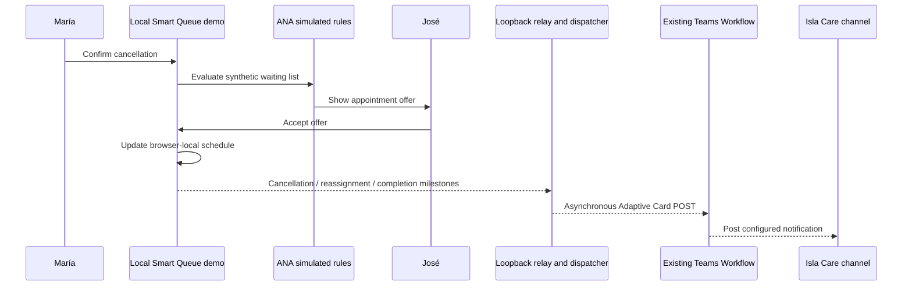

# Isla Care local Teams demo

This walkthrough reuses the existing **Isla Care → Smart Queue Notifications** channel and active workflow. It does not create Teams resources. The local workflow uses synthetic Smart Queue data; the public hosted demo never calls the Teams backend.

## Start the local app

1. Confirm the callback is configured only in ignored `backend/.env`, with `TEAMS_PLUGIN_ENABLED=true`. Do not print the value or place it in frontend configuration.
2. Start the backend from `backend/` with the project venv: `../.venv/bin/uvicorn app.main:app --host 127.0.0.1 --port 8000`.
3. Start the frontend from `frontend/`: `npm run dev`.
4. Open the local Vite URL. The local relay only accepts loopback HTTP clients and browser origins.

To serve the local build at `http://localhost:8000/` as one origin, stop any existing Uvicorn process on that port, build the regular local bundle (do **not** use `build:demo`), then run:

```bash
# frontend/
npm run build

# backend/
STATIC_DIR=../frontend/dist ../.venv/bin/uvicorn app.main:app --host 127.0.0.1 --port 8000
```

For a UI-only rehearsal, set `TEAMS_PLUGIN_ENABLED=false` in the process environment before starting Uvicorn. When Teams is enabled, cancellation and acceptance generate three live channel cards.

## Walk the scenario

1. Reset the demo if needed. In María's patient view, cancel the synthetic October 8 appointment. A best-effort `appointment.cancelled` card is queued.
2. ANA evaluates the deterministic demo waitlist and offers the slot to the eligible candidate. This local relay does not send the internal evaluation or invitation events; those event names remain available for actual transaction sources.
3. Switch to José's patient view and accept the offer. Smart Queue updates its in-memory demo schedule. The relay queues `appointment.reassigned` and `ana.workflow.completed`.
4. Check the existing `Smart Queue Notifications` channel and, if a card is missing, inspect the Power Automate flow run history and destination mapping.
5. Reset the browser demo for another run. Events are deduplicated in memory by generated IDs; restart clears delivery history.

The relay emits only appointment date/time, fixed fictional provider label, workflow status, and generated event/correlation IDs. It does not send patient names, IDs, clinical conditions, or response text. It is asynchronous and failure-isolated, so a Teams error does not interrupt the UI flow. The browser booking remains synthetic and in-memory; the relay is not a durable appointment transaction.

## Verified status

- Existing local webhook configuration is loaded from ignored `backend/.env`; configuration metadata was checked without printing the callback.
- A synthetic test notification received HTTP **202** from the existing workflow endpoint in one attempt. The Teams desktop UI later showed this test card in the target channel.
- The live browser scenario was run after restarting the current source build with Teams enabled. Teams visibly showed **Appointment cancelled**, **Appointment reassigned**, and **Scheduling workflow completed** cards in the configured channel. The Provider dashboard showed José at October 8, 2:00 PM and the waitlist changed from 4 to 3.
- Automated regression tests mock Teams responses and cannot confirm tenant delivery.
- The server's `POST /api/local-demo/events` requests returned **202 Accepted** for cancellation and schedule update. Channel verification confirmed the downstream Power Automate posts for all three scenario event types.
- A headless browser simulation with Teams disabled was also used earlier to confirm the UI relay and schedule path without sending external notifications. Payloads contained only allowlisted synthetic fields and shared one correlation ID.

Run the no-network relay regression with `cd frontend && npm run test:local-relay`; it verifies the two browser relay payloads without contacting Teams.

## Diagrams



See [setup](TEAMS_SETUP.md), [integration behavior and limitations](TEAMS_INTEGRATION.md), and [plugin architecture](PLUGIN_ARCHITECTURE.md).
