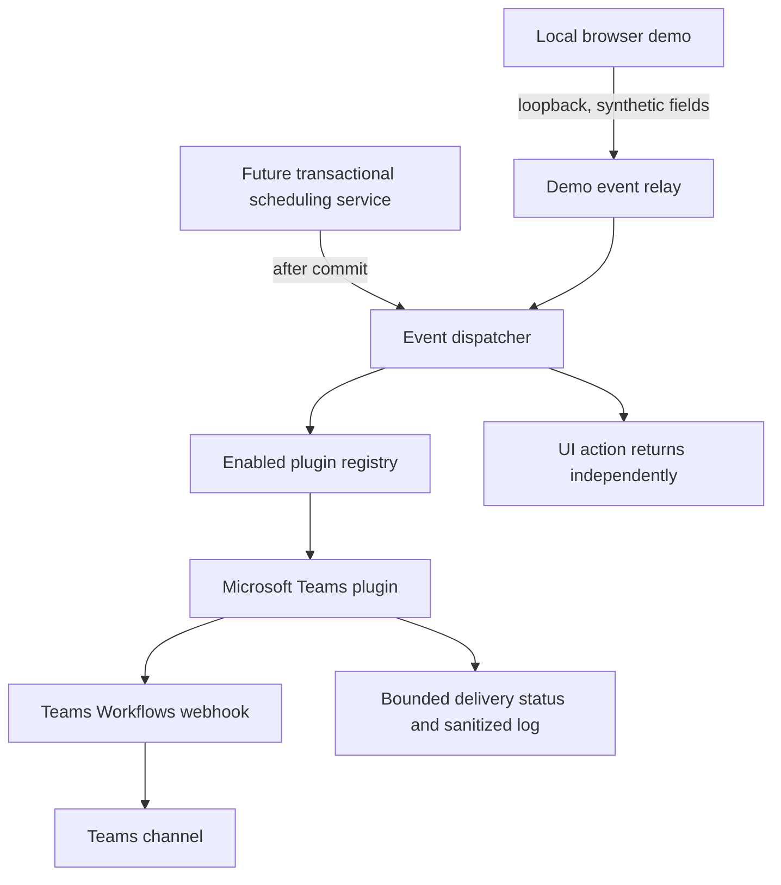
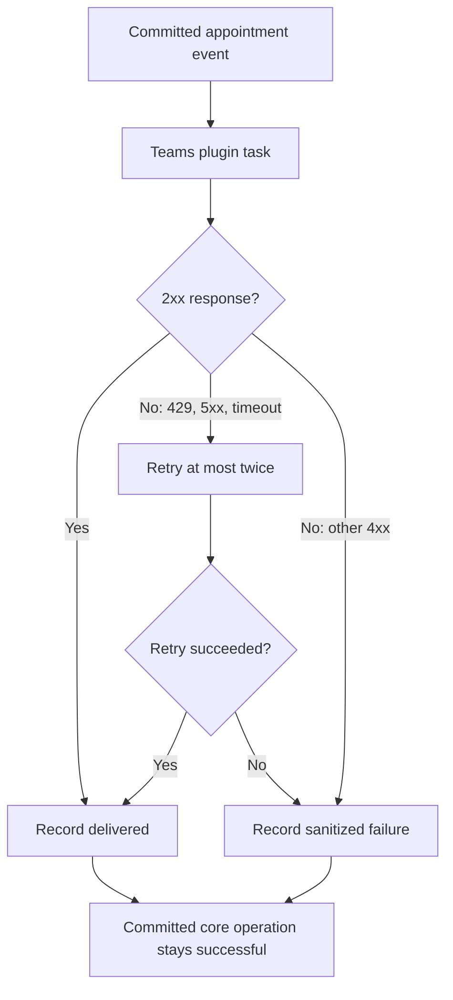

## Smart Queue plugin architecture

**Scope.** Backend-side optional notification extensions. The public judge build remains static and cannot contact the backend. For local development, two allowlisted synthetic UI milestones can be sent through `/api/local-demo/events`; it accepts only loopback clients and loopback HTTP origins. Backend booking/offer routers and scheduling services remain stubs, so this relay is not a transactional booking API.

### Components and lifecycle

`app/plugins/core/events.py` defines the allowlisted `ApplicationEvent` envelope. It accepts only appointment date/time, provider/resource label, workflow status, generated event ID, correlation ID, event type and UTC timestamp. It has no patient name/ID, clinical details, contact data or free-form description field.

`app/plugins/core/registry.py` provides explicit registration and subscriptions. `app/plugins/runtime.py` constructs an empty registry by default; when `TEAMS_PLUGIN_ENABLED=true`, configuration is validated and the Teams plugin is registered. Invalid enabled configuration stops backend startup. FastAPI creates the runtime in its lifespan and drains queued notification tasks on shutdown.

`app/plugins/core/dispatcher.py` accepts an event after the caller's successful transaction, deduplicates event IDs in a bounded process-local window, and schedules plugin delivery without waiting in the request path. A plugin exception is swallowed at this boundary. Teams itself records a bounded in-memory status history and logs only event type/ID, attempt count, HTTP status, and a sanitized error code.

### Adding another plugin

Implement the small protocol in `core/registry.py`: a stable `name`, a `subscribed_events` set, and asynchronous `handle(event)`. Keep provider credentials server-side, construct messages from an allowlisted event schema, set explicit timeouts, cap retries, and avoid logging payloads/URLs. Register it in `runtime.py` only when its validated configuration enables it. WhatsApp, email, SMS and future providers can subscribe to the same post-commit events without importing notification code into scheduling decisions.

### Safety and delivery semantics

- The plugin is disabled by default. No webhook URL is exposed to the frontend. The local demo relay is loopback-only, rejects non-loopback origins, and accepts only two fixed event types; there is no public proxy or integration management API.
- Delivery is best effort and asynchronous. A Teams timeout/failure cannot roll back an appointment operation. There is no durable outbox or delivery database yet.
- Event-ID deduplication and recent delivery status are in process memory and bounded. A restart clears them. Retrying after an ambiguous timeout may result in a duplicate Teams card; Workflows does not provide an idempotency contract to this sender.
- Teams requests use HTTPS only, reject non-Microsoft workflow host suffixes, disable redirects, and have a bounded timeout and bounded retry policy. Keep the backend's outbound network policy restricted as an additional SSRF boundary.
- Notifications use generic fixed descriptions. Demo mode explicitly marks synthetic data. Live mode also omits patient names, record IDs, diagnoses, and raw reply text. Do not put protected health information into provider/resource labels or correlation IDs.
- Do not enable live mode until real authentication, authorization, consent, backend persistence, retention, operational ownership, and security review are complete.

### Event publishing contract

The local demo relay publishes `appointment.cancelled` for its synthetic cancellation milestone, then `appointment.reassigned` and `ana.workflow.completed` after the confirmed synthetic schedule update. It accepts only those two transition kinds and fixed synthetic metadata; patient names and UI text are never accepted. Future real booking services must call `publish_after_commit(dispatcher, event)` only after durable transactions commit. Evaluation, invitation, acceptance and failure events should be emitted only at their actual transaction boundaries.

## Microsoft Teams integration

The adapter uses Teams Workflows' webhook trigger and an Adaptive Card `message` envelope. Notification fields are event title/type, appointment date/time, provider/resource, workflow status, fixed summary, event timestamp, correlation ID and optional dashboard link. It never formats patient identity or clinical-condition fields. See [Teams setup](TEAMS_SETUP.md) for tenant-side workflow configuration.

Supported events are `appointment.cancelled`, `ana.waitlist.evaluated`, `ana.invitation.sent`, `ana.invitation.accepted`, `appointment.reassigned`, `ana.workflow.completed`, and `ana.workflow.failed`. Default subscriptions are cancellation, reassignment, completed, and failed; configure a comma-separated allowlist with `TEAMS_NOTIFICATION_EVENTS`.

Run tests from `backend/` with the repository Python environment: `../.venv/bin/python -m pytest -q`. Tests mock HTTP responses; none contact Teams. Send one deliberately configured synthetic test card with `../.venv/bin/python -m app.plugins.test_notification`. This command requires the plugin enabled and a real workflow URL and therefore performs external delivery. Verify that URL in environment configuration, not in shell arguments or source files. A result confirms webhook acceptance; check the channel to confirm the flow posted it.

### Current limitations

There are no implemented backend booking APIs, persistence/outbox, event emission sites, integration settings UI, real delivery health endpoint, or live end-to-end scenario. The browser-only Vercel app still completes its synthetic flow without network calls. Connecting event calls to future backend transitions, proving the final Teams channel delivery in a configured tenant, and completing live security/consent reviews remain required before describing notifications as an active app feature.
