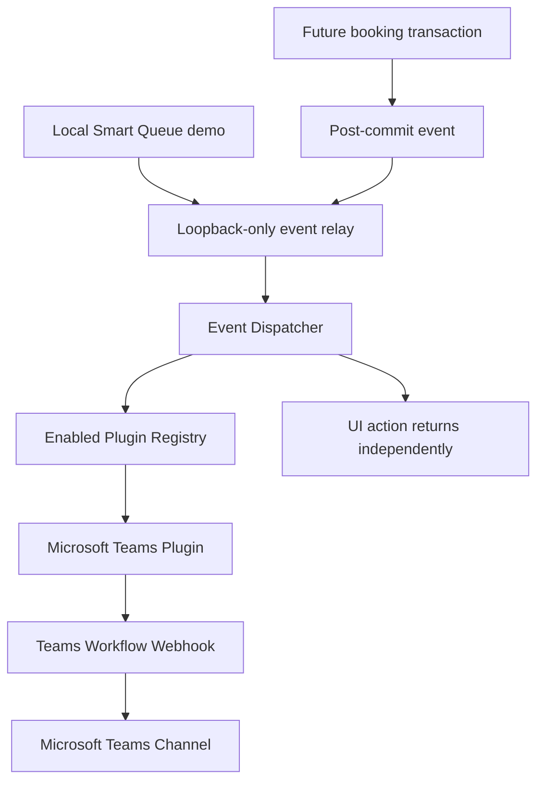
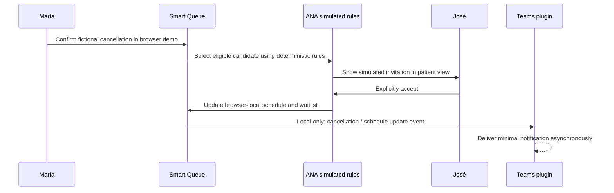
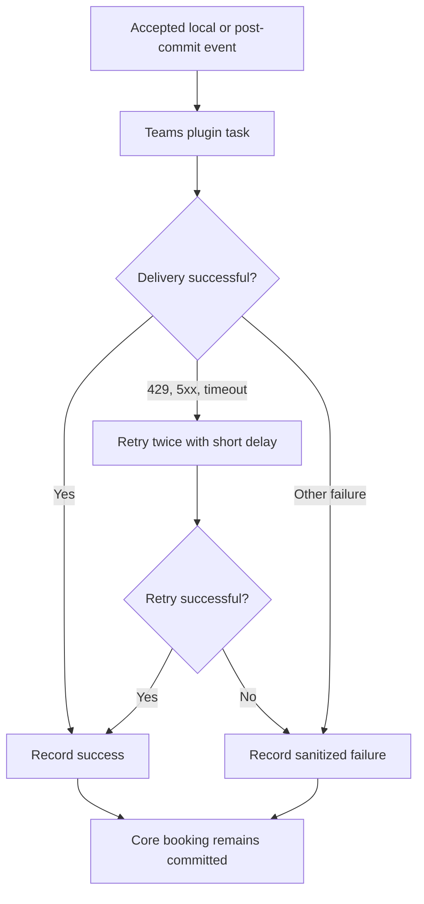

# Microsoft Teams plugin integration

## Implementation

The integration is an optional backend plugin, disabled by default. The public app remains a static browser-only demo and never contacts Teams. In local development, an allowlisted relay accepts only `cancelled` and `updated` synthetic story milestones from loopback clients with a loopback browser origin. It dispatches minimal events; it does not create or persist bookings and does not replace future post-commit events from transactional services.

| Component | Responsibility |
|---|---|
| `core/events.py` | Allowlisted event types and minimal notification envelope |
| `core/registry.py` | Explicit plugin registration and event subscriptions |
| `core/dispatcher.py` | Bounded in-process event-ID dedupe and nonblocking task dispatch; isolates errors |
| `runtime.py` | Empty registry by default; validates and registers Teams only when enabled |
| `teams/config.py` | Environment configuration validation and webhook host restrictions |
| `teams/formatter.py` | Fixed-text Adaptive Cards without patient supplied data |
| `teams/client.py` | HTTPS request, no redirects, bounded timeout/retries, sanitized result |
| `teams/plugin.py` | Event subscription, bounded recent status, sanitized operational logs |
| `services/events.py` | Helper for future scheduling service to publish only after commit |
| `main.py` | Loopback-only local demo relay; fixed synthetic provider and no patient text |
| `plugins/test_notification.py` | Explicit synthetic end-to-end webhook smoke command |

## Events

| Event | Default | Card summary |
|---|---:|---|
| `appointment.cancelled` | Yes | A cancellation opened a synthetic appointment slot |
| `ana.waitlist.evaluated` | Optional | Candidates checked by configured scheduling rules |
| `ana.invitation.sent` | Optional | Synthetic offer generated for patient review |
| `ana.invitation.accepted` | Optional | Patient accepted the synthetic offer |
| `appointment.reassigned` | Yes | Accepted appointment reflected in provider schedule |
| `ana.workflow.completed` | Yes | Scheduling workflow completed after patient confirmation |
| `ana.workflow.failed` | Yes | A step needs staff review |

Each card includes the event title, appointment date/time, provider/resource, workflow status, fixed summary, UTC timestamp and correlation ID. A generic HTTPS dashboard link is optional. There is no patient name, patient identifier, diagnosis, condition text, phone/email, or user supplied description. In demo mode the card identifies synthetic data. Live mode does not add patient data; it is only a mode label, not production authorization.

## Data flow



The demo state remains in browser memory. In local non-public mode, cancellation sends a synthetic cancellation event; explicit patient acceptance updates local demo state and sends reassignment plus workflow-completed events. Calls are best effort and do not block UI. No patient identity is sent. The public build skips these requests and its CSP denies network connections.



ANA is currently deterministic simulation in the demo, not a connected model. Staff-confirmed scheduling priorities and deterministic compatibility/ranking rules decide candidate ordering. Teams is informational and never determines bookings.

## Failure handling



Delivery is best effort. Three total attempts maximum, redirects disabled. Logs include event type and ID, status code, attempt count and a short error class. The webhook URL, response body and request payload are not logged. IDs are deduplicated in a bounded process-local cache. Status history is also bounded and lost on restart. A network timeout after Teams accepted the request can still produce a duplicate card on retry; there is no durable outbox or Teams-side idempotency in this implementation.

## Configure and test

Follow [Teams Workflows setup](TEAMS_SETUP.md). Automated tests use `httpx.MockTransport`, do not require a tenant and never make external requests:

```bash
cd backend
../.venv/bin/python -m pytest -q
```

The browser relay path is covered separately with mocked API responses and makes no Teams calls: `cd frontend && npm run test:local-relay`.

A deliberate external test needs an enabled plugin and a callback URL provisioned into the backend environment. From `backend/` run `../.venv/bin/python -m app.plugins.test_notification`. It sends only one generic synthetic test card. A 2xx confirms trigger acceptance; inspect Power Automate run history and the channel to validate posting.

## Remaining work and limits

- The booking, cancellation, waitlist and offer API routes remain stubs. Local relay events describe synthetic UI milestones, not committed backend transitions. Implement transaction services and call `publish_after_commit` only after each commit.
- The static Vercel build has a restrictive CSP and no API requests. The webhook URL remains backend-only; the relay accepts only loopback requests and allowlisted synthetic fields.
- No durable notification outbox, persisted delivery status, configurable settings UI, secure test endpoint, or production authentication/authorization exists.
- A synthetic test against the configured workflow returned HTTP 202 and its card was visually verified in Teams.
- The live local cancellation → José acceptance scenario was verified in the configured channel: cancellation, reassignment, and workflow-completed cards appeared. The synthetic provider schedule also reflected José's new time.
- Before live data, complete real account/role security, patient consent, retention, monitoring and privacy review. A successful test webhook is not a production readiness assessment.

See [plugin architecture](PLUGIN_ARCHITECTURE.md) for extension guidance and bounded delivery semantics.
